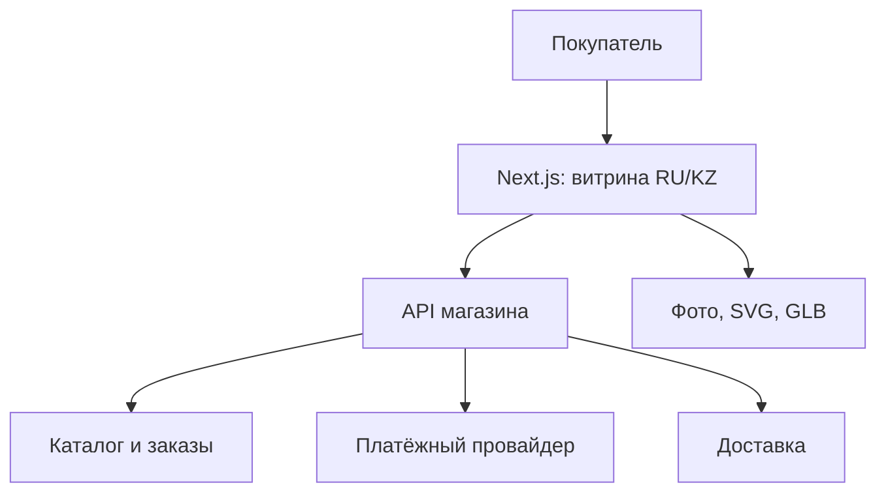
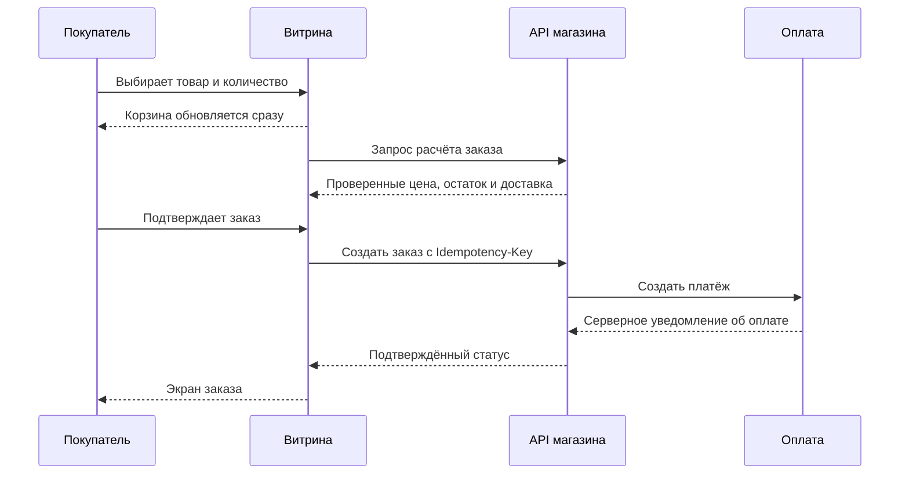

# Алмұрт — архитектура интернет-магазина

**Версия:** 1.0 · 23.09.2026. **Область:** mobile-first витрина RU/KZ, каталог, карточка товара, корзина, оформление заказа, анимированный маскот и опциональная 3D-сцена. Версии пакетов зафиксированы в `almurt_frontend.md`.

> Архитектура основана на известных требованиях. Приложенный HTML-план содержит только оболочку страницы без содержимого iframe; платежи, доставка, админка и свойства товаров остаются открытыми решениями.

## Принципы

1. Товары, цены и переход к покупке доступны до загрузки анимации.
2. Категории и карточки товаров имеют индексируемые адреса на обоих языках.
3. WebGL не требуется для работы магазина. Ошибка сцены оставляет статичный постер.
4. API является источником истины для цены, остатков, доставки, заказа и оплаты.
5. Стартуем с одного приложения Next.js и одного API, без микрофронтендов.

## Границы системы



**Витрина** рендерит страницы, собирает корзину и данные покупателя, показывает подтверждённый сервером заказ. **API магазина** хранит товары и заказы, считает итог, проверяет остатки, создаёт платёж и обрабатывает уведомление провайдера. Next.js может выступать тонким BFF через серверные компоненты и route handlers, но не заменяет систему учёта заказов и серверную интеграцию оплаты.

## Модули

| Директория | Ответственность |
| --- | --- |
| `app/[locale]/` | Маршруты, серверная загрузка, layout, metadata, обработка ошибок. |
| `features/catalog/` | Поиск, фильтры и выдача. Состояние фильтров хранить в URL. |
| `features/product/` | Галерея, выбор варианта, добавление в корзину. |
| `features/cart/` | Локальный отклик, количество и удаление; серверная проверка при оформлении. |
| `features/checkout/` | Форма и этапы заказа; итог берётся от API. |
| `features/hero/` | Постер, SVG-маскот, отдельно загружаемая 3D-сцена. |
| `entities/` | Типы и преобразование товара, категории, варианта, заказа. |
| `shared/api/`, `shared/ui/`, `shared/i18n/` | API-клиент, общие элементы, словари. |

```text
src/
  app/[locale]/
    page.tsx
    catalog/page.tsx
    category/[slug]/page.tsx
    product/[slug]/page.tsx
    cart/page.tsx
    checkout/page.tsx
    order/[id]/page.tsx
  app/sitemap.ts
  app/robots.ts
  features/{catalog,product,cart,checkout,hero}/
  entities/{product,category,order}/
  shared/{api,ui,i18n,config}/
  styles/globals.css
public/media/{posters,mascot,models}/
```

Модули остаются папками внутри одного приложения. Отдельные npm-пакеты нужны только если появятся независимые потребители.

## Рендеринг страниц

| Страница | На сервере | В браузере | Данные |
| --- | --- | --- | --- |
| Главная | Тексты, подборки, постер, SEO | Меню, маскот, необязательное 3D | Контент кэшировать до обновления. |
| Каталог/категория | Первая выдача, фильтры из URL | Панель фильтров | Каталог обновлять по правилам API. |
| Товар | Название, описание, фото, SEO | Галерея, вариант, «В корзину» | Цену и наличие перепроверять при покупке. |
| Корзина | Оболочка | Позиции и количество | Не кэшировать персональные данные публично. |
| Checkout | Предварительный расчёт | Контакты, доставка, подтверждение | Новый серверный расчёт перед оплатой. |
| Заказ | Статус из API по сессии/токену | При необходимости обновление | Закрыт от публичной индексации и кэша. |

## Поток покупки



- В браузере хранить `productId`, `variantId`, `quantity`. Локальная цена служит только для предварительного отображения.
- Гостевой заказ подходит для MVP. При необходимости авторизацию добавить позднее.
- API предотвращает дублирование заказа при повторной отправке и сообщает об изменении цены или отсутствии товара.
- Возврат пользователя со страницы оплаты сам по себе не означает, что платёж прошёл.

## Локализация и SEO

- Отдельные URL `/kk/...` и `/ru/...`, язык документа, `hreflang`, canonical, индивидуальные title/description, sitemap.
- Переключение языка сохраняет тот же товар/категорию, если перевод есть. UI-словарь отделить от локализованных полей каталога.
- Проверять длину казахских подписей и переносы на 320 px. Цены форматировать в KZT.
- На товарной странице использовать `Product`/`Offer` только из корректных актуальных данных API. Checkout и частные заказы не индексировать.

## Анимация и скорость

- `HeroCopy` и `HeroPoster` показывать сразу. SVG-маскот анимировать CSS/Motion; для сложных состояний можно отдельно подготовить Rive.
- `HeroScene` загружать динамически только на главной, после критического контента. При ошибке WebGL, слабом устройстве или `prefers-reduced-motion` оставлять постер.
- 3D в формате GLB проверять на среднем Android и Safari iPhone; при уходе сцены с экрана приостанавливать рендер. Пакеты Three.js не импортировать в общий layout или карточки товаров.
- Для первого экрана задавать размеры изображений и приоритет загрузки по измерениям; изображения ниже экрана загружать лениво.
- Целевые реальные мобильные метрики p75: LCP ≤ 2,5 с, INP ≤ 200 мс, CLS ≤ 0,1. Проверять также с отключённым 3D.
- Меню, фильтры, форма и корзина работают с клавиатурой, скринридером и настройкой уменьшения движения.

## Начальный контракт API

```text
GET  /categories
GET  /products?locale=&category=&q=&sort=&page=
GET  /products/:slug?locale=
POST /checkout/quote
POST /orders              (Idempotency-Key)
GET  /orders/:id/status   (по защищённой сессии/токену)
```

До интеграции согласовать ID, slug, варианты, изображение, пагинацию, ошибки, скидки, `currency=KZT` и единицу `price.amount` (например, целые тиыны). Если API хранит десятичные тенге, явно нормализовать на границе данных и проверить округление. Типы желательно генерировать из OpenAPI.

## Порядок внедрения

1. Дизайн-токены, мобильная сетка, навигация и контракт API.
2. Каталог → товар → корзина → гостевой checkout с серверным расчётом.
3. RU/KZ, SEO, доставка и юридические страницы по требованиям бизнеса.
4. Постер и анимация маскота; отдельно прототип 3D с замерами мобильной скорости.
5. Сквозной тест покупки, ошибки API, доступность, Lighthouse и реальные Web Vitals.

**Открытые решения:** источник каталога и админка; платёжный провайдер; доставка; состав вариантов товара; содержание приложенного плана и бюджет 3D.
